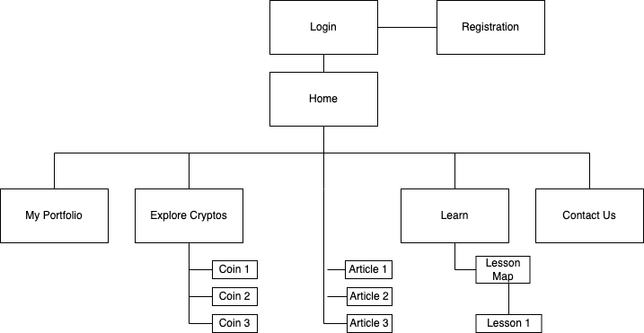
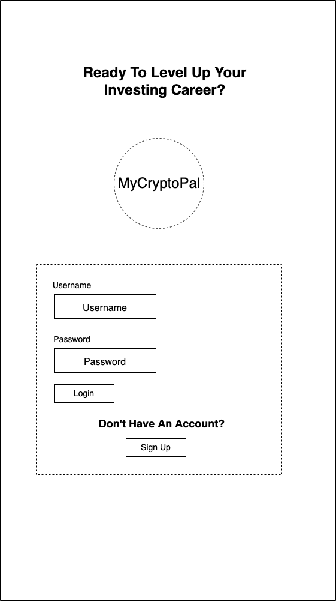
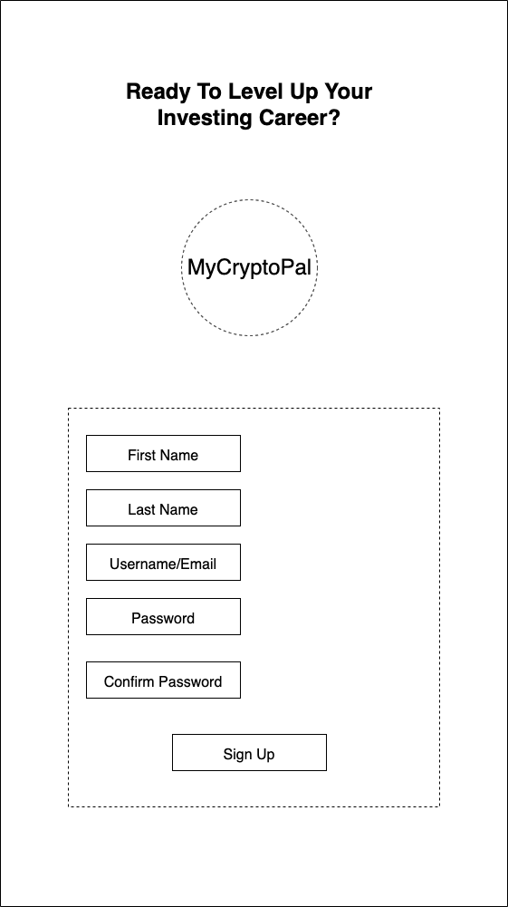
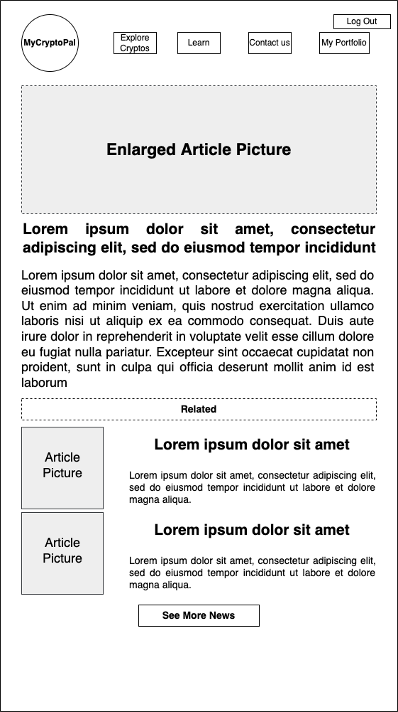
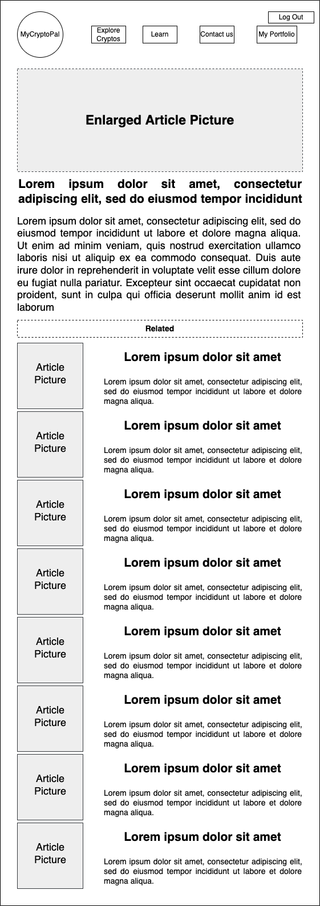
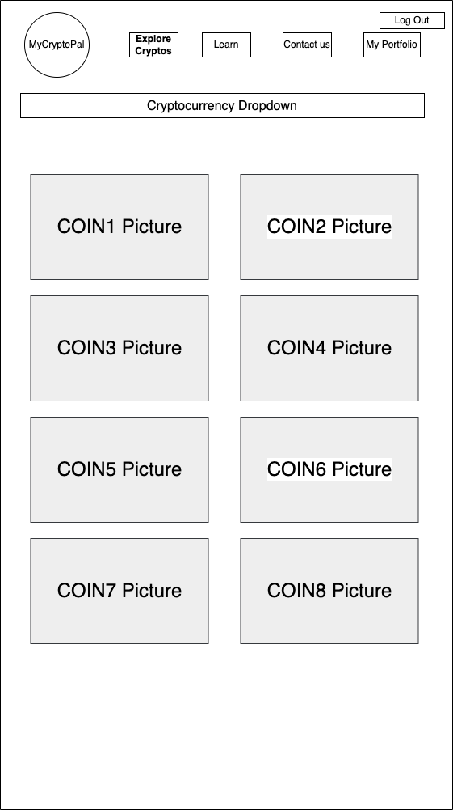
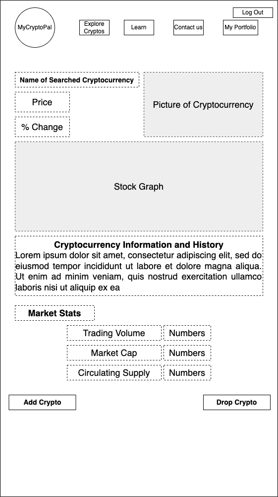
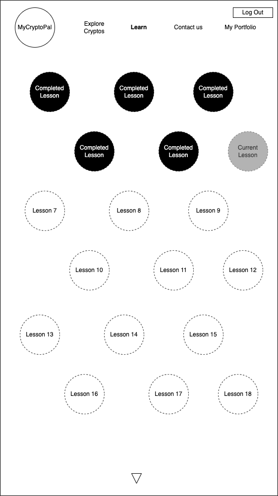
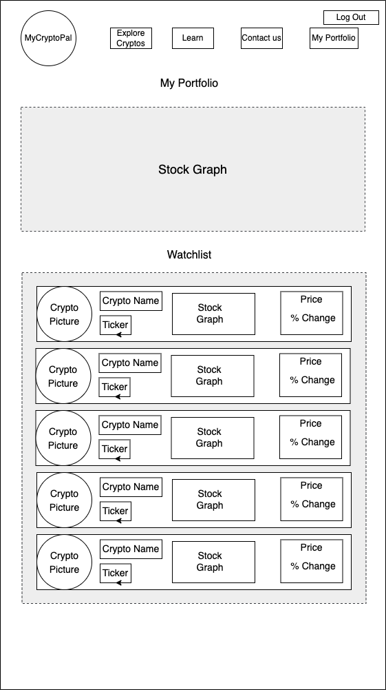
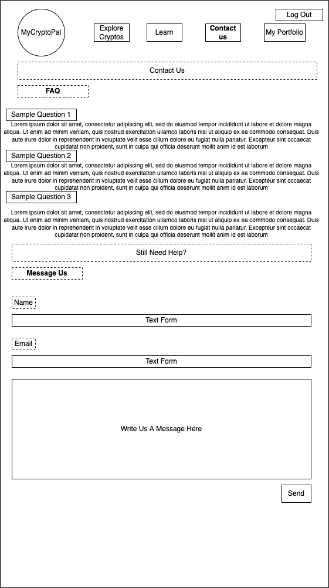

# User Experience Design

### MyCryptoPal prototype
[PDF of Prototype](ux-design/prototype/AppPrototype.pdf)

[URL to Invision prototype](https://blakerainey605421.invisionapp.com/console/share/8JU2WM6ZA5F)

### MyCryptoPal Site Map

### Login page

### Registration page

### Home page where users can see a summary of their portfolio as well as a number of news articles

### Sample news article. Upon clicking on 'See More News', users will be able to see more news articles and scroll indefinitely (as long as there are articles remaining)

### Explore page where users can look up cryptocurrencies

### Sample individual cryptocurrency page containing its information, prices, history, etc.

### Learn page where users can access lessons on blockchain and cryptocurrency

### Sample interactive lesson page with quiz

### Portfolio page showing analytics relating to the user's investment

### Contact page containing frequently asked questions as well as forms for users with further inquiries
