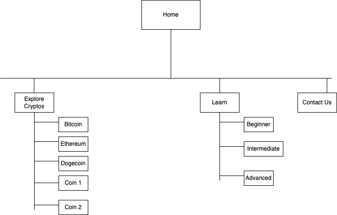
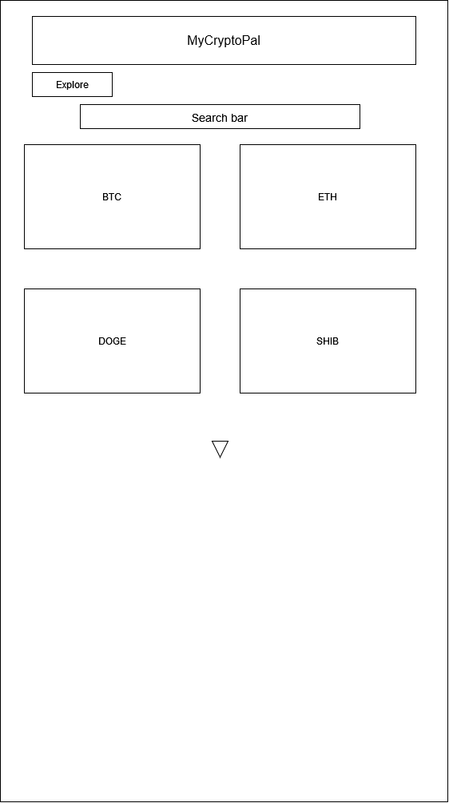
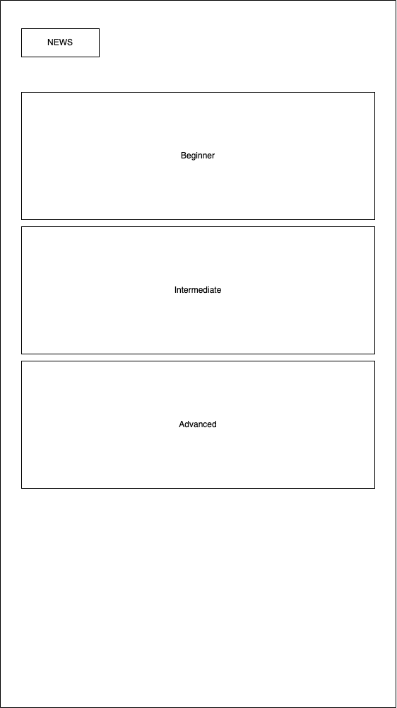
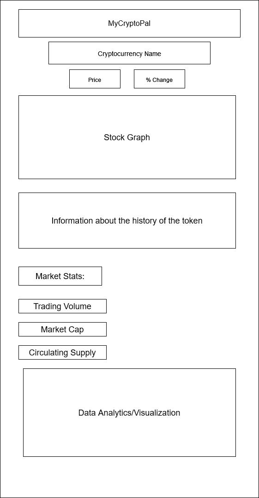
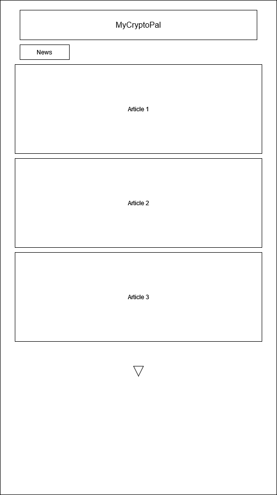
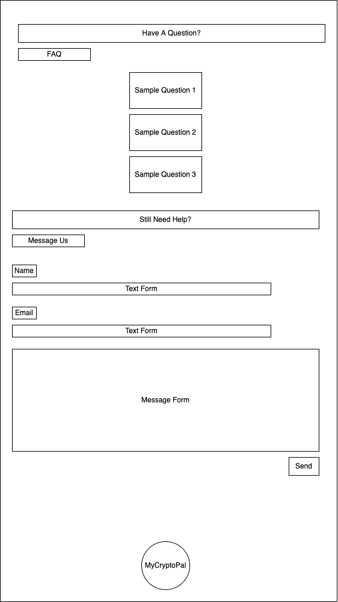

# User Experience Design

### Our prototype
[PDF of Prototype](ux-design/prototype/AppPrototype.pdf)

[Hosted prototype on Invision](https://blakerainey605421.invisionapp.com/console/share/QFSK65NZHGP/882151514)

### This is our sitemap

### Our home page of the app, containing links to all other pages

### This page is where people can explore more cryptos

### This page is where we will teach people about cryptos, where the user can select lessons based on their knowledge level and check their progress

### This page is where the lessons for the user are located

### This page is to show some analytics surrounding cryptocurrencies that are either in your portfolio or have been looked up in the app

### This page contains news articles regarding cryptocurrencies

### This is our contact us page

