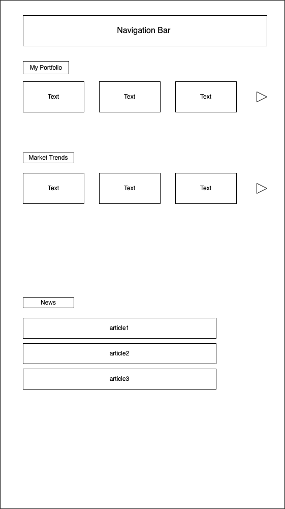
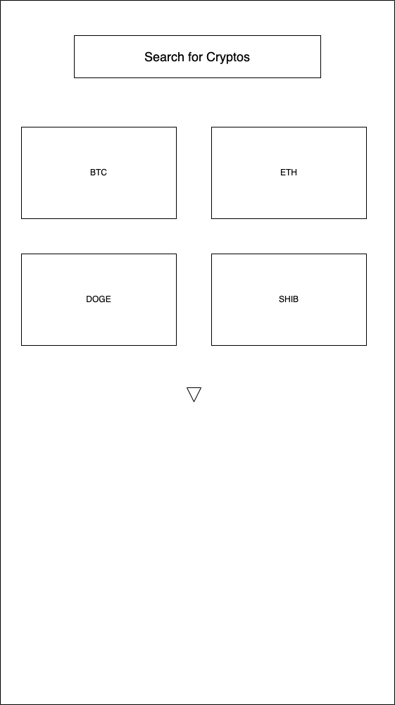
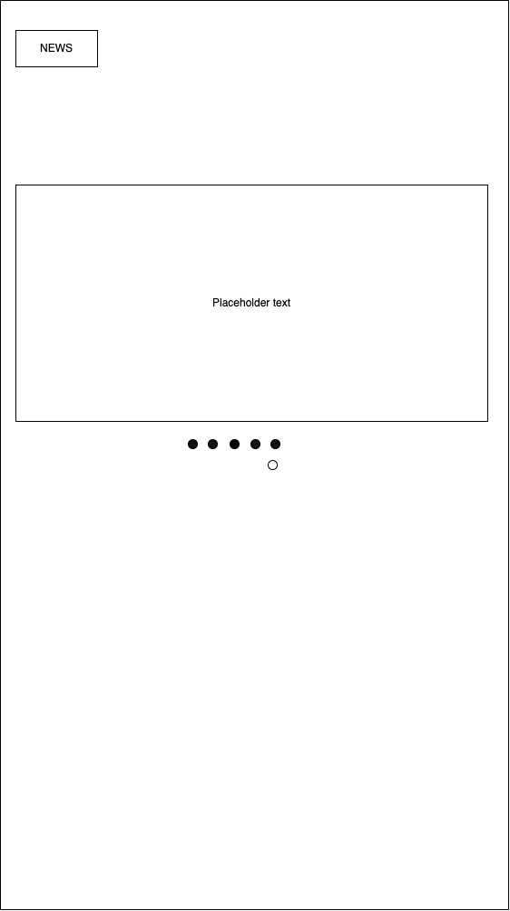

# User Experience Design

This repository contains instructions and files for two assignments that together comprise the user experience design phase of a web app.

Replace the contents of this file with the completed assignments, as described in:

### this is our sitemap

### Our home page of the app, quite self explanitory

### This page is where we will teach people about cryptos

### This page is where people can explore more cryptos

### this page is to determine the user education level

### this page is to show some analytics surrounding your portfolio

### this is our contact us page, also pretty self explanitory

### Our prototype
[invision prototype](https://blakerainey605421.invisionapp.com/console/share/QRAJDUY2PS8/881869811)

